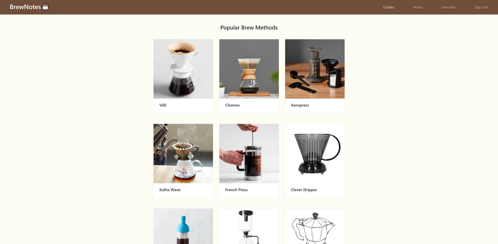
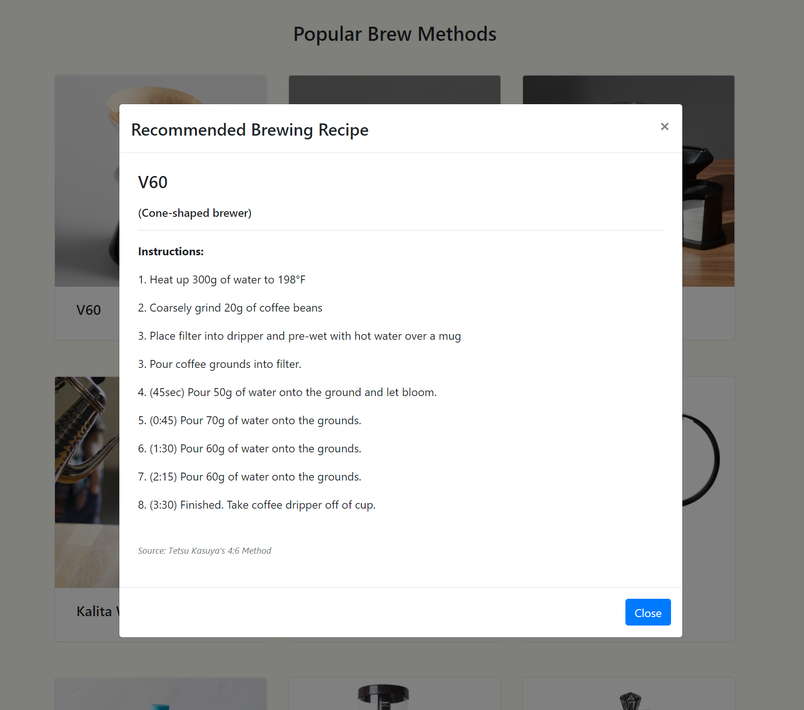
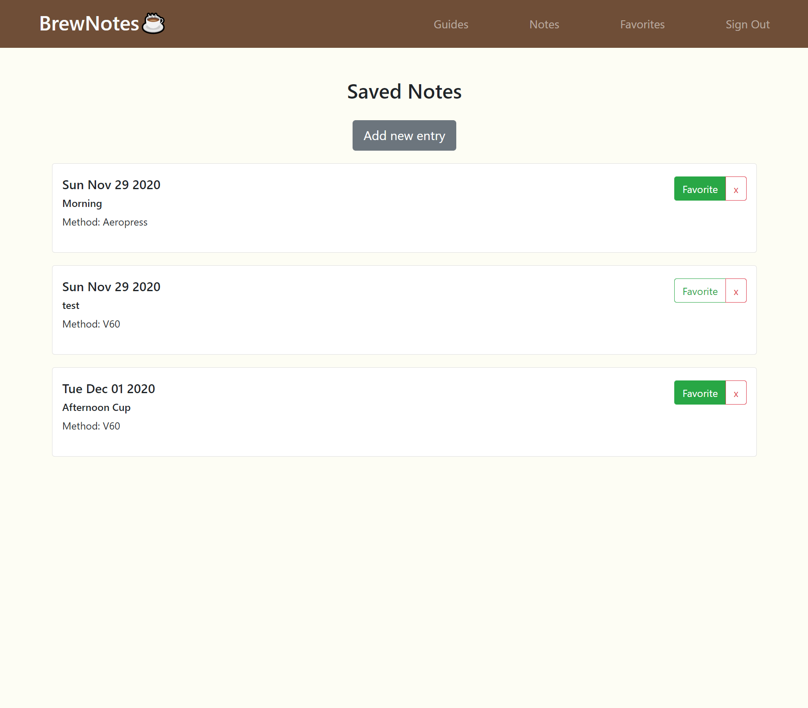
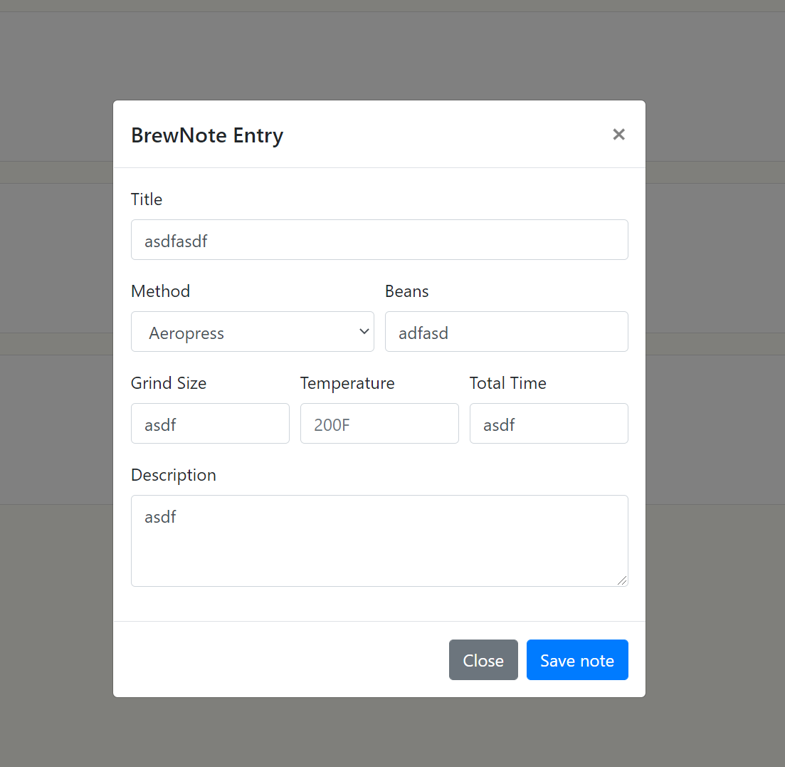

# BrewNotes
A curated resource coffee brewing methods and a note-taking application for coffee-enthusiasts.

## Description
This was a personal project to address a desire I had to have a simple way to log and keep track of the cups of coffee that I was brewing everyday. After signing up and logging in users are able to click on cards in the guides section to view recommended recipes for different brewing methods and also take notes on their coffee (method, beans used, grind size, brew temperature, time, extra notes). Adding a note works by entering information into the input form regarding brew details and then saving the note will generate a new section on the note page pertaining to the newly saved note. Editing notes works by clicking on the note you wish to edit and simply changing the information within the note and clicking to the save the note. Notes can also be favorited and compiled to the favorites page for quick access to favorite notes or deleted.

## Table of Contents
* [Getting Started](#getting-started)
* [Installation](#installation)
* [Usage](#usage)
* [Author](#author)
* [License](#license)

## Getting Started
* [Github Repository](https://github.com/nathanmvu/brew-notes)
* [Deployed Link](https://brewnotes.herokuapp.com/)
* [Usage Demo Video](https://drive.google.com/file/d/1xFScKjhdxmcCBwr5CxhvDfLU9La1qZeU/view)

Demo of guides:


Demo of notes:


## Installation
You access the application via the deployed link here:
* [Deployed Link](https://brewnotes.herokuapp.com/)

To run the program locally, install it from the repository and then in an integrated terminal run
`npm start`
and the program will launch in a web browser. 

## Usage
Guides Page:


Recipes: 


Notes Page:


Notes Entry/Details:


### Code Snippets
Some of the code written to set state for the modal props which are used to determine what state the note modal should be in and how it should be displayed.
```
function Notes({
  favoritesPage,
}) {

  const [notes, setNotes] = useState([]);
  const [modalProps, setModalProps] = useState({
    isOpen: false,
    note: null,
    editingNote: false,
  });

  function newNote() {
    setModalProps({
      isOpen: true,
      note: {},
      editingNote: false,
    });
  }

  function editNote(note) {
    setModalProps({
      isOpen: true,
      note,
      editingNote: true,
    });
  }

  function closeModal() {
    setModalProps({
      isOpen: false,
      note: null,
      editingNote: false,
    });
    loadNotes();
  }
```

## Author
* Nathan Vu
* [Github](https://github.com/nathanmvu)
* [Email](mailto:nathanvu99@gmail.com)

## License
[](https://github.com/tterb/atomic-design-ui/blob/master/LICENSEs)